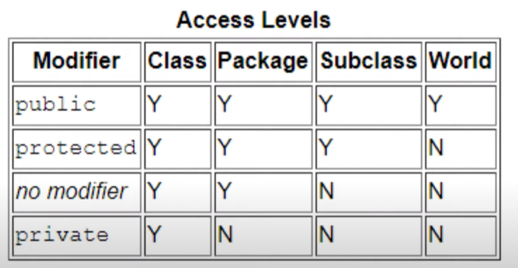

# section 4 

## Inheritance 
- The process where one class acquires, the attributes and methods of another.

## method overriding 
- Declaring a method in sub class, which is already present in parent class.
- So that a child class can give its own implementation
		
## Super 
- keyword refers to the superclass (parent) of an object
- very similar to the "this" keyword

## Abstract 
- Abstract classes cannot be instantiated, but they can have a subclass
- Abstract methods are declared without an implementation
- Data Abstraction may also be defined as the process of identifying only the required characteristics of an object ignoring the irrelevant details. 
- The properties and behaviors of an object differentiate it from other objects of similar type and also help in classifying/grouping the objects.
- In java, abstraction is achieved by interfaces and abstract classes.

## Advantages of Abstraction
- It reduces the complexity of viewing things.
- Avoids code duplication and increases reusability.
- Helps to increase the security of an application or program as only essential details are provided to the user.
- It improves the maintainability of the application. 
- It improves the modularity of the application. 
- [read more](https://www.geeksforgeeks.org/abstraction-in-java-2/)

## java access modifiers
- The access modifiers in Java specifies the accessibility or scope of a field, method, constructor, or class
- There are four types of Java access modifiers:
   -  **Private**: The access level of a private modifier is only within the class. It cannot be accessed from outside the class.
   -  **Default**: The access level of a default modifier is only within the package. It cannot be accessed from outside the package. 
   -  **Protected**: The access level of a protected modifier is within the package and outside the package through child class.
   -  **Public**: The access level of a public modifier is everywhere. 

    

		
## Encapsulation 
- Attributes of a class will be hidden or private, 
- Can be accessed only through methods (getters & setters)
- You should make attributes private if you don't have a reason to make them public/protected

## Interface
- The interface in Java is a mechanism to achieve abstraction. 
- There can be only abstract methods in the Java interface, not the method body. 
- It is used to achieve abstraction and multiple inheritance in Java. 
- Java Interface also represents the IS-A relationship.

### Why do we use an Interface?
- It is used to achieve total abstraction.
- by using an interface it can achieve multiple inheritances.
- Any class can extend only 1 class but can any class implement infinite number of interface.
- It is also used to achieve loose coupling.
- Interfaces are used to implement abstraction. So the question arises why use interfaces when we have abstract classes?
- The reason is, abstract classes may contain non-final variables, whereas variables in the interface are final, public and static.

- [read more](https://www.javatpoint.com/difference-between-abstract-class-and-interface)

## 	Polymorphism 
- greek word for poly-"many", morph-"form"
- The ability of an object to identify as more than one type
- Dynamic Polymorphism:  means after compilation (during run )

## Exception 
- an event that occurs during the execution of a program that, disrupts the normal flow of instructions